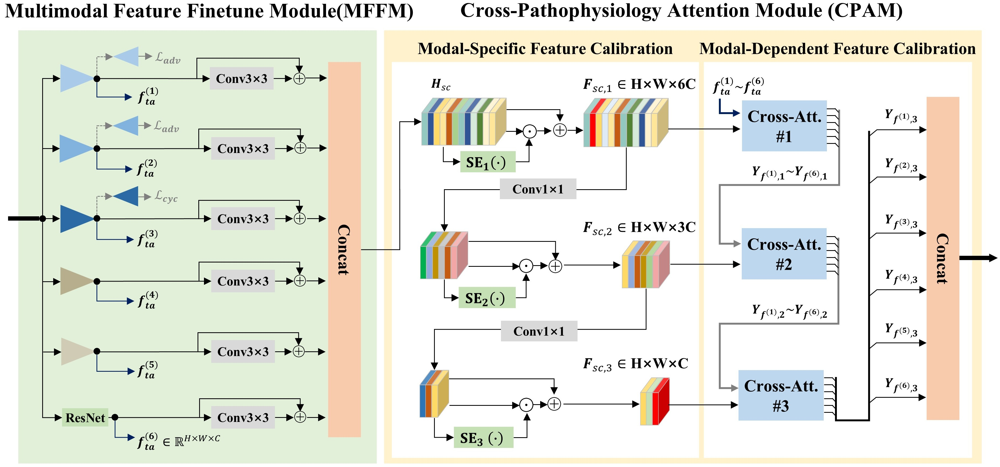

## Quasi-multimodal-based pathophysiological feature learning for retinal disease diagnosis<br/>
Lu Zhang, Huizhen Yu, Zuowei Wang, Fu Gui, Yatu Guo*, Wei Zhang*, and Mengyu Jia*<br/>
<p align="center">
  


## Train and Evaluate QMP-RETNet ##

Python version 3.8 is required and all major packages used and their versions are listed in `requirements.txt`.

Clone this repo
```
git clone https://github.com/zlu866/QMP-RETNet
cd QMP-RETNet
```
### QMP-RETNet on MuReD Dataset ###
Download MuReD data (5.68G)
```
https://prod-dcd-datasets-cache-zipfiles.s3.eu-west-1.amazonaws.com/pc4mb3h8hz-1.zip
```
* Put the data under `./data/`

* Train New Model
```
python train.py  --batch_size 16  --lr 0.00001 --classes 20  --dataset_name 'MuReD' --dataroot ./data/
```
* Evaluate Model
```
python test.py  --batch_size 16  --classes 20  --dataset_name 'MuReD' --dataroot ./data/
```

### QMP-RETNet on DDR Dataset ###
Download DDR data (14G)
```
https://drive.google.com/drive/folders/1z6tSFmxW_aNayUqVxx6h6bY4kwGzUTEC
```
* Put the data under `./data/`

* Train New Model
```
python train.py  --batch_size 16  --lr 0.00001 --classes 5  --dataset_name 'DDR' --dataroot data/
```
* Evaluate Model
```
python test.py  --batch_size 16  --classes r  --dataset_name 'DDR' --dataroot ./data/
```
## Citation ##

If you find this useful for your research, please use the following.

```
```
